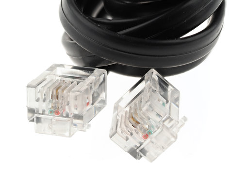

# Lecture 4.3 - The Networking Basics

If you are not interested in networking or how "it all works" when it comes to networking, this section is still for you.

## Cables

### Phone (RJ11)

"Back in the day", home phones existed and were tethered to the home from an outside connection. Once within the home, the phone lines used the RJ11 cable standard, or Registered Jack 11.

### Ethernet (RJ45)

Similar however more capable, is the Ethernet cable, or also known as the RJ45 cable. These are the most common type of networking cable both at home and in businesses. There are various standards of Ethernet cabling named after their Category (CAT) followed by a numerical value that provides various capabilities. For today's standard/society, you want to use at minimum a Cat5E cable for at home use or any small businesses.

|                    | Cat3    | Cat5             | Cat5e            | Cat6             | Cat6a       | Cat7        |
|--------------------|---------|------------------|------------------|------------------|-------------|-------------|
| Cable Type         | UTP     | UTP              | UTP              | UTP or STP       | STP         | S/FTP       |
| Transmission Speed | 10 Mbps | 10/100/1000 Mbps | 10/100/1000 Mbps | 10/100/1000 Mbps | 10,000 Mbps | 10,000 Mbps |
| Bandwidth          | 16 MHz  | 100 MHz          | 100 MHz          | 250 MHz          | 500 MHz     | 600 MHz     |

### Coax

Coaxial cable is another popular standard that is used by 'cable' ISPs. Commonly used to deliver internet, tv, and phone to the home however remained reliable and accurate transmissions. It consists of a shielded copper core that does not easily succumb to interference or damage from the environment.

### Fiber-Optic

The latest and greatest method of data transmission is the use of Fiber Optic cabling. These are very thin and fragile cables that utilizes lasers on both ends to transmit light through glass that runs along the cable. Fiber optic cables themselves to not suffer data-loss 'in the cable' itself, however the primary driver for signal strength are the end-pieces/connectors on each end of the fiber optic cable. Fiber optic cables provide both enthusiast home users, business, and large server farms the ability to transmit at a rate faster than 10 Gbps at distances that are uneconomical via copper (Ethernet).

## Devices

### Modem

From the ISP, a cable is brought in from outside of your home or apartment into what could be a patch panel, or simply brought in through the walls of your house. This cable plugs into a modem regardless of ISP type (dial-up, cable, etc.) and is the physical device that communicates with your (customers) network and the ISPs.

### Routers

From the modem, the cable runs to the router which then takes the IP address assigned by your ISP and also creates a local network for your home/apartment. Modern routers at times include antennas to also distribute Wi-Fi around an area, or even include other quality of life features like the capability to attach a hard-drive to your network, virtual private networks, and some include meshing capability.

Today, ISPs offer modem, router, access-point combos be it free or with a rental fee

### Access Point

It is not common to purchase a dedicated device for Wi-Fi distribution, however an access point is connected to the router that is purpose built to take the ethernet signal to wireless radio frequencies. Generally routers include antennas and Wi-Fi capability with 'dual-band' features and 'triple-band' features.

Wi-Fi has three common radio frequencies in use today, 2.4 GHz, 5 GHz, and 6 GHz. Routers or access-points that advertise dual-band include the 2.4 GHz and 5 GHz bands while tripe-band or 'Wi-Fi 6' capability means 6 GHz frequencies.

To briefly touch on Wi-Fi bands, the lower the frequency, the smaller the channel width, while the higher frequency includes larger channel widths. Without diving deep into Wi-Fi frequencies, channel widths, etc. 2.4 GHz Wi-Fi provides the greatest amount of wall-penetrating ability with largest range, while 6 GHz provides the least amount of range however the greatest speed capability.

Note, that Wi-Fi and access points are only a few parts of 'the equation' of a device receiving internet via Wi-Fi. Your device be it phone or laptop also need to have strong enough signal to send data back to the access point. Suffice to say, Wi-Fi is a two way transmission and both devices need to have the power to both receive and transmit data back and forth as you browse the internet.

### Switches

Switches, are in short a simpler 'type' of router. Most consumers or homes do not include switches as part of their home network, however in commercial spaces both routers and switches look very similar but serve very different purposes. Switches are similar to routers however they do not communicate directly to the modem, but enable additional physical connectivity on the network when connected to the router.

## Network Layering (OSI)

A few concepts that were not covered are where all these devices fit into the networking layer model. This model is also named the Open Systems Interconnection (OSI) (Model) that describes all the functions involved in sending data over the Internet split across 7 layers; the model is an abstract conceptualization of _how_ the internet works and helps people talk about network design.

### Layers of the OSI Model

- Layer 1: Physical Layer
  - (Internet) packets are converted into electrical, radio, or optical pulses and transmitted as bits over wires and/or radio waves.
- Layer 2: Data Link
  - Handles the communications between two devices on the same network. Ethernet is the most common method of achieving layer-2 communications e.g. switches
- Layer 3: Network Layer
  - Handles the communication between two devices across **different** networks. e.g. routers. Utilizes IP and ICMP protocols.
- Layer 4: Transport Layer
  - Provides the means of transmitting data between two end-points. Handles the quality of service and commonly utilizes TCP and UDP protocols.
- Layer 5: Session Layer
  - Controls the connections between computers, however this layer can also be handled by Layer 4.
- Layer 6: Presentation Layer
  - Data is translated into a form of which the application can accept.
- Layer 7: Application Layer
  - Data is generated by and usable by a software applications. e.g. when you utilize an internet-browser or game, the application's requests and receiving of data is translated at this layer.
